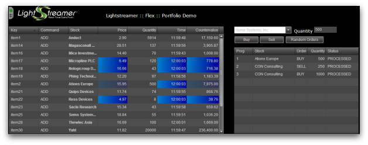

# Lightstreamer - Portfolio Demo - Flex Client #

<!-- START DESCRIPTION lightstreamer-example-portfolio-client-flex -->
The *Portfolio Demo* simulate a portfolio management: it shows a list of stocks included in a portfolio and provide a simple order entry form. Changes to portfolio contents, as a result of new orders, are displayed on the page in real-time. In addition to that, the *Full Version of the Portfolio Demo* also shows, for each stock in the portfolio, the current price, updated in real-time from a market data feed.

This project is a Flex version of the [Portfolio Demo - HTML Client](https://github.com/Lightstreamer/Lightstreamer-example-Portfolio-client-javascript#portfolio-demo---html-client), and includes a Flex client front-end for the [Lightstreamer - Portfolio Demo - Java Adapter](https://github.com/Lightstreamer/Lightstreamer-example-Portfolio-adapter-java), written for Flex 4 SDK.

## Live Demo

### [ View live demo](http://demos.lightstreamer.com/Flex_PortfolioDemo)

*Note. Real-Time simulated Portfolio data is received from the Lightstreamer Server deployed at [http://push.lightstreamer.com](http://push.lightstreamer.com).*

## Details

This app uses the [Flex Client API for Lightstreamer](https://lightstreamer.com/api/ls-flex-client/latest/index.html) to handle the communications with Lightstreamer Server and uses the **Flex DataGrid** to display the real-time data.

The left table shows the automatic binding of a Lightstreamer data table configured to exploit "two-level push" with a Flex widget (a DataGrid). You can sort on any columns and drag the columns around.

Using the form to the right, you can buy or sell a stock.
Clicking the "Random Orders" button, 20 random orders are placed in batch mode. Orders are placed through the [LSClient.SendMessage](https://lightstreamer.com/api/ls-flex-client/latest/com/lightstreamer/as_client/LSClient.html#sendMessage()) method.

The DataGrid, below the orders form, mantains a list of executed orders and their statuses (PROCESSING, PROCESSED, ABORTED or ERROR). Such statuses are received by the demo code by listening for [SendMessageAbortEvent](https://lightstreamer.com/api/ls-flex-client/latest/com/lightstreamer/as_client/events/SendMessageAbortEvent.html), [SendMessageErrorEvent](https://lightstreamer.com/api/ls-flex-client/latest/com/lightstreamer/as_client/events/SendMessageErrorEvent.html), and [SendMessageProcessedEvent](https://lightstreamer.com/api/ls-flex-client/latest/com/lightstreamer/as_client/events/SendMessageProcessedEvent.html) events and then placed in an ArrayCollection that is, in turn, bound to the DataGrid. 

This portfolio is shared among all the connected users, so you can connect to this demo from different machines (or try at least different browsers on the same machine), then submit orders from one browser and see the updates displayed on another browser. The same portfolio is also shared among the various versions of the demo (Flex and HTML).

Tables involved:
* A [VisualTable](https://lightstreamer.com/api/ls-flex-client/latest/com/lightstreamer/as_client/VisualTable.html) containing 1 item subscribed to in <b>COMMAND</b> mode. Each added row automatically provokes an underlying subscription to a sub-item in <b>MERGE</b> mode, to get the real-time price for that specific stock from another feed (the same as the [Stock-List Demos](https://github.com/Lightstreamer/Lightstreamer-example-Stocklist-client-javascript)). When a row is deleted, the underlying sub-item is automatically unsubscribed from.

<!-- END DESCRIPTION lightstreamer-example-portfolio-client-flex -->
## Install
If you want to install a version of this demo, pointing to your local Lightstreamer Server instance, follow the steps below.

* The *Flex Client Portfolio Demo*, needs both the *PORTFOLIO_ADAPTER*, from the *Portfolio Demo*, and the *QUOTE_ADAPTER*, from the *Stock-List Demo* (see [Lightstreamer - Stock-List Demo - Java Adapter](https://github.com/Lightstreamer/Lightstreamer-example-StockList-adapter-java)). As a prerequisite, the full version of the [Lightstreamer - Portfolio Demo - Java Adapter](https://github.com/Lightstreamer/Lightstreamer-example-Portfolio-adapter-java) has to be deployed on your local Lightstreamer Server instance. Please follow the instructions in [Install the Portfolio Demo](https://github.com/Lightstreamer/Lightstreamer-example-Portfolio-adapter-java#install-the-portfolio-demo) to install it.
* Get the `deploy.zip` file of the [latest release](https://github.com/Lightstreamer/Lightstreamer-example-Portfolio-client-flex/releases), unzip it, and copy the `Flex4_PortfolioDemo` folder into the `pages` folder of your Lightstreamer Server installation.
* The client demo configuration assumes that Lightstreamer Server, Lightstreamer Adapters, and these clients are launched on the same machine. If you need to target a different Lightstreamer server, please edit the `index.html` file.
The configuration lines for the hostname and port can be easily found at the beginning of the `index.html` file and can be modified manually, without the need for a recompilation. Then, to allow the page to get resources from a different server, the Web Server address has to be included in the `/crossdomain.xml` file deployed under Lightstreamer Server. See the `<flex_crossdomain_enabled>` element in the Server configuration file for details.
* Open your browser and go to [http://localhost:8080/Flex4_PortfolioDemo](http://localhost:8080/Flex4_PortfolioDemo).

## Build 
To build your own version of `Flex4PortfolioDemo.swf`, instead of using the one provided in the `deploy.zip` file from the [Install](https://github.com/Lightstreamer/Lightstreamer-example-Portfolio-client-flex#install) section above, follow the steps below.

* Download this project. This project includes the following sub-folders:
    * `/src` contains the sources to build the Flex application (the code is based on Flex 4 SDK);
    * `/lib` should contain the Lightstreamer library, to be used for the build process.
* Download the [latest Lightstreamer distribution](http://www.lightstreamer.com/download) and copy the Lightstreamer_as_client.swc file from the Lightstreamer Flex Client SDK, located under the `/DOCS-SDKs/sdk_client_flex/lib` folder, into the `lib` folder of the project.
* Download `swfobject.js` version 2.2 file from [SWFObject 2](http://code.google.com/p/swfobject/downloads/list) copy it into the `lib` folder of the project.

## See Also

### Lightstreamer Adapters Needed by This Client

<!-- START RELATED_ENTRIES -->
* [Lightstreamer - Portfolio Demo - Java Adapter](https://github.com/Lightstreamer/Lightstreamer-example-Portfolio-adapter-java)
* [Lightstreamer - Stock-List Demo - Java Adapter](https://github.com/Lightstreamer/Lightstreamer-example-Stocklist-adapter-java)

<!-- END RELATED_ENTRIES -->

### Related Projects

* [Lightstreamer - Portfolio Demos - HTML Clients](https://github.com/Lightstreamer/Lightstreamer-example-Portfolio-client-javascript)
* [Lightstreamer - Stock-List Demos - Flex Clients](https://github.com/Lightstreamer/Lightstreamer-example-StockList-client-flex)

## Lightstreamer Compatibility Notes

- Compatible with Lightstreamer Flex Client API version 2.1 or newer.
- Ensure that Flax Client API is supported by Lightstreamer Server license configuration.
